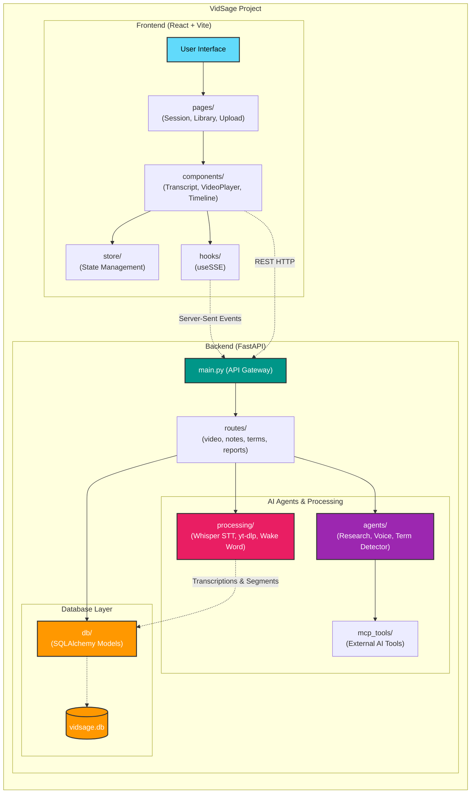

# Video Transcript Extraction API

This service extracts audio from video files and transcribes them using OpenAI's Whisper API.

## Prerequisites

- Python 3.7+
- ffmpeg (system dependency)

## Installation

1. Create and activate a virtual environment:
   ```bash
    python -m venv venv
   .\.venv\Scripts\activate
   ```

2. Install dependencies:
   ```bash
   pip install -r requirements.txt
   ```

## Usage

### Environment Variables

Create a `.env` file in the backend directory:
```env
OPENAI_API_KEY="your-key-here"
```

### Running the Server

```bash
python3 server.py
```

The server listens on port 5000.

### API Endpoints

#### POST /api/extract_audio
Upload a video file to extract audio.

**Request:**
- Method: `POST`
- Content-Type: `multipart/form-data`
- Field: `video_file` (video file)

**Response (200 OK):**
```json
{
  "audio_path": "uploads/audio_1715976000.wav"
}
```

#### POST /api/transcribe
Transcribe an audio file using OpenAI Whisper.

**Request:**
- Method: `POST`
- Content-Type: `application/json`
- Body:
  ```json
  {
    "audio_path": "uploads/audio_1715976000.wav"
  }
  ```

**Response (200 OK):**
```json
{
  "segments": [
    {
      "start": 0.0,
      "end": 1.0,
      "text": "Hello.",
      "speaker": "A"
    }
  ]
}
```

## Project Structure

```
backend/
├── server.py             # Main API server
├── services/             # Business logic and external integrations
│   ├── video_service.py  # Video processing and audio extraction
│   └── transcription_service.py  # OpenAI Whisper integration
├── utils/                # Helper utilities
│   └── file_utils.py     # File operations and cleanup
├── uploads/              # Uploaded files (temporary)
├── .env                  # Environment variables
└── requirements.txt      # Python dependencies
```

# Backend Architecture


