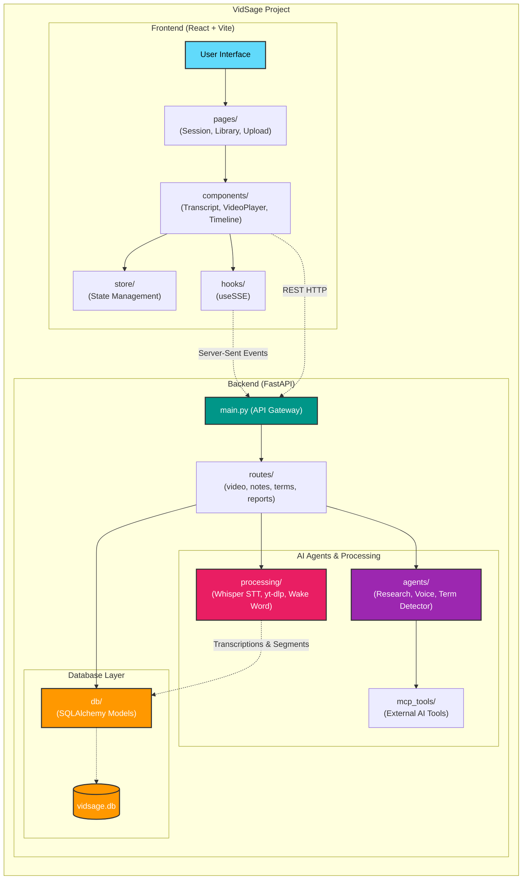

# VidSage Architecture & Directory Structure

Here is a high-level overview of the VidSage project architecture, showing the relationship between the React frontend and the FastAPI backend, along with their internal directory structures.

### Key Components:
- **Frontend**: A modern React application utilizing Tailwind CSS and Framer Motion for dynamic animations. It consumes SSE (Server-Sent Events) for real-time status updates and manages state across components like the VideoPlayer, ActiveTranscript, and TermPanel.
- **Backend API**: Built with FastAPI, acting as the orchestrator. It handles routing and background tasks.
- **AI Agents**: Specialized Python modules (e.g., Voice Agent, Research Agent) that route intent and analyze transcripts.
- **Processing Layer**: Heavy-lifting pipelines including Faster-Whisper for STT with word-level timestamps and yt-dlp for video ingestion.
- **Database**: SQLite with SQLAlchemy ORM handling persistent storage for videos, notes, terms, and transcripts.
